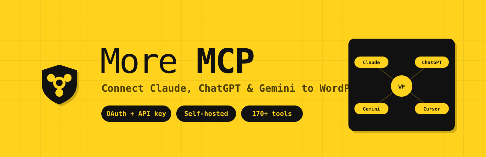
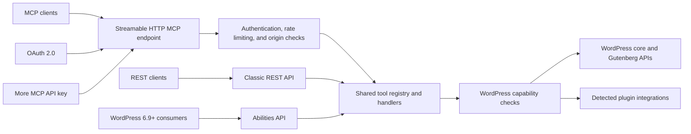

<p align="center">
  
</p>

<p align="center">
  
</p>

<h1 align="center">More MCP</h1>

<p align="center"><strong>Give AI assistants a safe, authenticated way into WordPress.</strong><br>Self-hosted OAuth and API keys, per-tool capability checks, audit logging, and 101–160 tools.</p>

More MCP is a self-hosted [Model Context Protocol](https://modelcontextprotocol.io/) server built into WordPress by Mordenhost. Claude, ChatGPT, Gemini, AI coding assistants, and any other MCP-compatible agent operate your site through typed, permission-checked tools — no screen scraping, no browser automation, no copy-paste.

Where a bare MCP bridge stops at exposing functions, More MCP is built for sites that are actually in production. Every request authenticates through OAuth 2.0 or an API key, hits a per-IP rate limit, and passes a WordPress capability check inside the tool handler before it touches anything. Interactions are logged for audit — tool names and argument keys, never the argument values. Nothing leaves your database: no license server, no telemetry, no callback to Mordenhost or anyone else.

A standard installation exposes 101 tools for WordPress core and Gutenberg. Compatible plugins add specialized tools automatically, while ten high-impact plugin and theme lifecycle tools remain disabled until an administrator explicitly enables them. Depending on the active integrations and permissions, a site can expose between 101 and 160 tools through the native MCP endpoint, the classic REST API, and the WordPress Abilities API on WordPress 6.9 or later.

## Contents

- [How it works](#how-it-works)
- [Requirements](#requirements)
- [Installation](#installation)
- [Tool inventory](#tool-inventory-101160-tools)
- [Plugin integrations](#plugin-integrations-conditional)
- [Supported clients and platforms](#supported-ai-platforms)
- [Security and privacy](#why-security-matters)
- [Frequently asked questions](#frequently-asked-questions)
- [License](#license)

## How it works



All three public tool surfaces route into the same registry and handlers, so capability checks and tool behavior remain consistent. The primary endpoint is:

```text
https://yoursite.com/wp-json/more-mcp/v1/mcp
```

OAuth discovery and authorization endpoints live at the domain root.

## Why security matters

MCP tools can read, create, update, and delete WordPress data. More MCP protects that access with:

- OAuth 2.0 authorization code flow with PKCE and refresh-token rotation.
- Static API-key authentication for clients that do not support OAuth.
- Timing-safe credential comparison and authenticated session initialization.
- Origin validation and per-IP rate limiting of 60 requests per minute.
- WordPress capability checks inside every tool handler.
- Audit logging that records tool names and argument keys, never argument values.
- Read-after-write verification for mutation tools.
- Dry-run, confirmation, guard, and undo mechanisms on supported high-impact operations.
- `Cache-Control: no-store` across the More MCP namespace to prevent authenticated responses from being reused by URL-keyed edge caches.

## At a glance

| Area | What More MCP provides |
|---|---|
| Authentication | OAuth 2.0 or a self-hosted More MCP API key |
| Protocol | MCP `2025-11-25` over Streamable HTTP and JSON-RPC 2.0 |
| Tool count | 101 always registered; 101–160 depending on integrations and permissions |
| WordPress support | WordPress 5.8+; Abilities API integration on WordPress 6.9+ |
| Runtime | PHP 7.4+; PHP 8.0+ recommended |
| Data ownership | Credentials, tokens, sessions, and logs stay in your WordPress database |
| Vendor coupling | None—no license server, telemetry, or More MCP cloud service |

## Requirements

- **PHP 7.4 or later.** PHP 8.0+ is recommended — it is what the plugin is developed and tested against, and PHP 7.4 reached end of life in November 2022, so it no longer receives security fixes from the PHP project.
- **WordPress 5.8 or later.** Tested up to WordPress 7.0.
- **MySQL 5.6+ or MariaDB 10.1+** — activation creates five tables.
- **HTTPS**, for any client using the OAuth connector flow. The OAuth 2.0 specification requires it, and Claude Desktop's native connector will not complete a handshake over plain HTTP. Static API-key auth works without it but sends the key in a header, so HTTPS is strongly recommended there too.
- **Pretty permalinks** must be enabled (Settings → Permalinks, anything other than "Plain"). The OAuth endpoints are served from domain-root rewrite rules, which do not exist under the plain permalink structure.
- **WordPress 6.9 or later** for the Abilities API surface. This is optional — the MCP endpoint and the REST API work on 5.8+ regardless.

## Free, self-hosted, and fully featured

More MCP is fully featured in its free, GPL-licensed release. There is no Pro version &mdash; all tools ship in the wp.org plugin, and updates go through the standard WordPress plugin updater.

Your credentials stay on your server. More MCP runs entirely inside WordPress: API keys, OAuth tokens, and session state all live in your own database. More MCP makes no outbound connections to any vendor server &mdash; no license check, no telemetry, no traffic beacon. If you prefer to keep AI inference local too, Ollama and LM Studio are first-class platforms alongside Claude, ChatGPT, and Gemini.

## Tool inventory: 101–160 tools

Every installation registers **101 tools**: 82 WordPress core tools and 19 Gutenberg tools. Five detected integrations can add 49 tools, and ten plugin/theme lifecycle tools appear only when an administrator enables them. A site therefore exposes **101–160 tools**, depending on its active plugins and permissions.

**WordPress Core (82 tools):**

- Posts - create, read, update, delete, search, count (any registered public post type, featured images supported)
- Pages - full CRUD with parent page support
- Post Types - discover all registered public post types on the site
- Post Revisions - list revision history and roll a post back to any prior version
- Media - browse, upload from URL or base64, update alt text/caption/title/description, set as featured image, delete
- Comments - create, read, delete; full moderation suite (list pending, approve, mark spam, trash)
- Users - display names and roles (emails and usernames are not exposed)
- Categories & Tags & Custom Taxonomies - create, update (rename/re-slug/edit/move), delete, assign, count, discover all registered taxonomies
- Term Meta - read, update, delete raw `wp_termmeta` values. For SEO fields on a term, use the SEO Meta tools below instead: Yoast keeps taxonomy SEO in an option and All in One SEO in its own table, so neither is reachable through term meta
- Menus - list menus, list menu items, create / update / delete / reorder menu items
- Post Meta - read, update, delete custom fields (works with ACF, MetaBox, JetEngine, Pods, CPT UI)
- SEO Meta - read and write title/description/focus keyword/noindex/canonical/OG/Twitter fields on posts **and terms**, across six SEO plugins (Yoast SEO, Rank Math, All in One SEO, SEOPress, Slim SEO, The SEO Framework). Each field is routed to wherever the detected plugin actually stores it; a field that plugin does not store is refused by name rather than written to a plausible-looking key that would save cleanly and change nothing on the page
- Site Info - site name, description, WordPress version, timezone
- Site Status - full site health snapshot (WordPress version, PHP version, active theme, active plugins, cron activity) for AI-driven pre-write validation
- Error Log - read recent PHP error log entries so AI agents can diagnose silent failures without shell access
- Cron Schedule - list scheduled WP cron events with next-run timestamps and hook names
- Connection Health - MCP session diagnostic returning route, auth method, session ID, and More MCP version details for any authenticated caller
- Plugins & Themes - list installed plugins and themes with active status
- Theme Appearance - get active theme, read/write theme mods (gated by admin toggle + allowlist), read/write Custom CSS
- Search - full-text content search across post types
- Permalink Structure - read and update permalink settings (gated by admin toggle)
- Options - read allowlisted core options, read full plugin settings by slug (sensitive keys redacted), and write to allowlisted options when an admin enables it

## Plugin and theme management (10 tools, opt-in)

Disabled by default. Enable "Allow AI to manage plugins and themes" under Settings → Permissions to expose these; while the toggle is off they are not listed to MCP clients at all.

These tools change the code running on your site, not just its content, so they are gated more tightly than anything else in the plugin:

- Every write requires the matching WordPress capability, re-checked inside the handler
- Every write requires a two-part confirmation: `confirm=true` AND `confirm_slug` echoing the exact target. A call without confirmation returns a preview of what would change, so the first call is always a dry run
- `wp_install_plugin` accepts WordPress.org slugs only — package URLs are rejected rather than downloaded, and the preview shows name, author, version, and active-install count so a typo-squat is visible before you confirm
- More MCP cannot deactivate or delete itself; the `more_mcp_protected_plugins` filter protects others
- Deleting a plugin requires deactivating it first — deletion is irreversible, so deactivation is the checkpoint
- Sites whose filesystem needs FTP/SSH credentials are refused rather than prompted; credentials must never travel through MCP arguments
- Every operation returns the state read back afterwards, so an upgrader that silently no-ops is visible rather than reported as success

Plugins: list pending updates, activate, deactivate, update, install (wp.org), delete.
Themes: list status with pending updates, activate (switch), update, delete.

## Plugin integrations (conditional)

More MCP automatically detects compatible plugins and adds specialized MCP tools. No configuration needed — if the plugin is active, the tools appear.

**WooCommerce Integration (29 tools):**
When WooCommerce is active, AI agents can manage your store end-to-end:

- Browse and search products by category, status, or type
- Create and update simple and variable products with prices, SKUs, stock levels
- Manage variable products — list, get, create, update, delete, and batch-update product variations
- Manage global attributes (`pa_*` taxonomies) — list registered attributes, list attribute terms, register new attributes, assign attributes to a product as variation axes
- Manage coupons — list, search by code, get, create, update, delete (trash or permanent), and bulk-purge trash; supports all standard WC coupon fields (discount type, expiry, usage limits, product/category restrictions, email allowlists)
- View orders, order details, and update order status
- List customers with order count and total spent
- Get store statistics — revenue, order count, average order value by period

**Elementor Integration (10 tools):**
When Elementor (free or Pro) is active, AI agents can clone and customize existing Elementor pages without trying to generate page-builder JSON from scratch:

- Clone an existing Elementor page with a new title and fresh element IDs (so the duplicate opens in the editor without ID collisions)
- Bulk-replace text across heading, text-editor, button, image-box, icon-box, icon-list, testimonial, tabs, accordion, toggle, star-rating, call-to-action, and flip-box widgets
- Swap image URLs across image, image-box, background_image, and gallery widget settings
- Get a compact outline of any page (section/container hierarchy, widget types, text snippets) so Claude can reason over a full page in a few KB instead of the raw JSON
- Read full settings for a single widget/container/section/column by ID (for precise agent editing without loading the entire page tree)
- Add a widget or container to an existing page, either from curated parameters for the common widget types or from a full settings object
- Change one element's settings in place, addressed by element ID. Settings are **merged** by default, not replaced: an Elementor settings object holds content next to styling, so a caller fixing a heading typo does not discard the widget's colours and typography. A wholesale replace is available but has to be asked for
- Delete one element and its descendants, addressed by element ID. The response reports how many elements went, and a dry run reports it before anything is removed
- Both addressed writes take an `expected_widget_type` guard and emit an undo token. Element IDs are per-document and shift when a page is rebuilt, so a stale ID would otherwise edit or delete the wrong part of the page
- Atomic widgets (Elementor 4.0+ Editor V4 elements) pass through opaque — we never decode atomic schemas because Elementor itself may shift them. Editing one is refused by name for that reason; deleting one is allowed, because removing a whole element needs only its boundaries, not its schema. Widget-level creation from scratch remains out of scope; the design commitment is to work from an existing-known-good source.

**Divi Integration (2 tools, read-only):**

- Read a compact positional outline from legacy Divi 4 `et_pb_*` shortcodes or native Divi 5 `divi/*` blocks without rendering the page or executing shortcodes
- Read one module or block by a dot-separated zero-based path returned by the outline
- Divi 4 attributes remain literal shortcode strings; Divi 5 attrs pass through verbatim because their internal schema is not a stable public contract
- Mixed Divi 5 pages keep legacy shortcode wrappers opaque rather than inventing a second addressing tree beneath them
- No writes, Theme Builder management, Theme Options, migration, or Divi settings management in this first increment

**Advanced Custom Fields Integration (4 tools):**
When ACF (free or Pro) is active, AI agents can read and write ACF fields with the field-type-aware formatting the ACF UI uses — instead of the raw serialized values WordPress meta returns:

- Read a single ACF field, formatted per its Return Format setting (hydrated post objects, parsed repeater rows, image arrays, etc.)
- Read every ACF field on a post in one call, with name/label/type/value bundled — the most efficient way for an AI to discover what fields exist and read them all
- Update an ACF field with type-aware value handling (scalar for text/number, array for repeaters and flex content, post ID for relationships, attachment ID for images)
- Enumerate ACF field groups on the site, optionally filtered by post type — for AI-driven discovery of available custom fields before reading/writing

**LiteSpeed Cache Integration (2 tools):**
When LiteSpeed Cache is active, AI agents can purge cached content after a write so visitors do not see stale pages:

- Purge the entire cache, or purge a specific URL
- Purge is driven through LiteSpeed's public `litespeed_purge_all` / `litespeed_purge_url` action hooks, not its internal classes, so the integration survives the plugin's internal refactors. No cache-stats tool is exposed because LiteSpeed has no stable public accessor for a file/size count across its disk, object-cache, and CDN layers

**Redirection Integration (4 tools):**
When John Godley's Redirection plugin is active, AI agents can manage 301 / 302 / 307 redirects:

- List redirects with group + URL-substring filters
- Create new redirects (source, target, status code, regex, group, title)
- Update existing redirects (target, status, enabled state)
- List redirect groups

## More MCP and the WordPress Core Abilities API

WordPress 6.9 shipped the Abilities API in November 2025 — a primitive that lets plugins register typed capabilities AI agents can call. Core ships three default abilities (site info, user info, environment info) and the `wordpress/mcp-adapter` package bridges abilities to the MCP protocol.

**Every More MCP tool also registers as a WordPress ability on WordPress 6.9 or later.** You get three ways to reach the same tools: (1) More MCP's native `/wp-json/more-mcp/v1/mcp` endpoint (unchanged and always available), (2) the WordPress MCP Adapter if you install it — More MCP registers a named `more-mcp-server` alongside adapter's default server, or (3) WordPress core REST directly at `/wp-json/wp-abilities/v1/abilities/{name}/run`. Same handlers, three transports, one set of per-tool capability gates. The abilities layer can be disabled with a single option flag if needed.

More MCP is a complete, production-ready MCP server that predates the official adapter. It runs the full Streamable HTTP transport, enforces API key authentication on every request, ships OAuth 2.0 for Claude Desktop's native connector flow, rate-limits per-IP, redacts sensitive data, and logs every interaction. Out of the box it registers 101 tools for WordPress core and Gutenberg. Five optional integrations add up to 49 tools when their host plugins are active, and ten lifecycle tools are available only after explicit administrator opt-in.

## Supported AI platforms

- **Claude** — Claude Desktop and other Claude clients with MCP support
- **OpenAI / ChatGPT** — ChatGPT and OpenAI clients that support remote MCP servers
- **Google Gemini** — Gemini clients and development tools with MCP support
- **Groq** — MCP-capable applications using Groq-hosted models
- **Azure OpenAI** — MCP-capable applications using Azure-hosted models
- **AWS Bedrock** — MCP-capable applications using Bedrock-hosted models
- **Ollama / LM Studio** - Local self-hosted models (no external data transmission)
- **Custom MCP Servers** - Connect to any MCP-compatible endpoint

## Compatible clients and frameworks

<!-- compliance: technical-context -->
More MCP works with any MCP-compliant client, IDE, or AI agent framework — no per-tool configuration required. Each entry below describes the specific integration path More MCP provides for that target, so customers can answer "will this work with the tool I already use?":

- **Desktop AI apps** - Claude Desktop (native MCP connector via OAuth 2.0), ChatGPT Desktop, Gemini Advanced.
- **AI code IDEs** - Claude Code, VS Code (with MCP extension), Cursor, Windsurf, Continue, Cline, Zed, JetBrains AI Assistant.
- **API testing tools** - Postman, Bruno, Insomnia (use the API key in the `MMCP-Key` header).
- **Custom field plugins** - Advanced Custom Fields (ACF) has dedicated `acf_*` tools that return values formatted per each field's Return Format setting (the same way the ACF UI shows them). MetaBox, JetEngine, Pods, CPT UI, and Custom Field Suite are supported through the `wp_get_post_meta` / `wp_update_post_meta` tools, so AI agents can populate custom fields just like a human editor.
- **Page builders** - Elementor has dedicated clone-and-customize tools. Divi has read-only structural tools for Divi 4 shortcodes and Divi 5 blocks. Beaver Builder, Bricks, Gutenberg, Spectra, and Stackable remain reachable through standard post or block content, but builder-specific storage is opaque unless covered by a dedicated integration.
- **Multilingual** - WPML, Polylang, TranslatePress, qTranslate. Translated posts appear as separate posts and can be read or written via the standard post tools.
- **AI agent frameworks** - LangChain, AutoGen, CrewAI, LlamaIndex, Haystack - any MCP-compatible framework can call More MCP's tools.
- **AI app platforms** - Anthropic Console, OpenAI Playground, Google AI Studio, Vertex AI, Azure AI Studio, Amazon Bedrock Console.

## MCP specification compliance

More MCP implements the [MCP 2025-11-25 Streamable HTTP transport specification](https://modelcontextprotocol.io/specification/2025-11-25/basic/transports#streamable-http):

- Single `/mcp` endpoint for all JSON-RPC communication
- POST for client messages, GET for server-sent events, DELETE for session termination
- Cryptographically secure session IDs with transient-based storage
- Origin header validation to prevent DNS rebinding attacks
- Proper CORS handling for browser-based MCP clients

## External services

More MCP does not call AI-provider APIs, operate a license server, send telemetry, or make vendor callbacks. It runs inside your WordPress installation and responds only when an authenticated MCP or REST client makes a request.

A separately configured client may send tool results—including requested WordPress content—to its AI provider. That transfer is controlled by the client and the provider account you choose, not by an outbound More MCP integration. Review the terms and privacy policy of your chosen client or provider before granting it access to your site.

**Common client providers:**

- **Claude** — Common client provider for Claude-based MCP connections
  [Terms of Service](https://www.anthropic.com/legal/consumer-terms) | [Privacy Policy](https://www.anthropic.com/legal/privacy)

- **OpenAI** — Common client provider for ChatGPT and OpenAI-based MCP connections
  [Terms of Use](https://openai.com/policies/terms-of-use) | [Privacy Policy](https://openai.com/policies/privacy-policy)

- **Google Gemini** — Common client provider for Gemini-based MCP connections
  [Terms of Service](https://ai.google.dev/terms) | [Privacy Policy](https://policies.google.com/privacy)

- **Groq** — Provider used by MCP-capable clients running Groq-hosted models
  [Terms of Service](https://groq.com/terms-of-use/) | [Privacy Policy](https://groq.com/privacy-policy/)

- **Microsoft Azure OpenAI** — Provider used by MCP-capable clients with Azure-hosted models
  [Terms of Service](https://azure.microsoft.com/en-us/support/legal/) | [Privacy Policy](https://privacy.microsoft.com/en-us/privacystatement)

- **AWS Bedrock** — Provider used by MCP-capable clients with Bedrock-hosted models
  [Terms of Service](https://aws.amazon.com/service-terms/) | [Privacy Policy](https://aws.amazon.com/privacy/)

- **Ollama / LM Studio** — Local self-hosted models (no external data transmission)

- **Custom MCP Servers** — User-configured servers (data sent to user-specified endpoints only)

## Installation

Requires PHP 7.4 or later (8.0+ recommended) and WordPress 5.8 or later. See Requirements in the description above for the full list, including the HTTPS and pretty-permalink prerequisites for OAuth connectors.

1. Upload the `more-mcp` folder to `/wp-content/plugins/`.
2. Activate **More MCP** from **Plugins** in WordPress.
3. Open **More MCP → Settings** and enable the server.
4. Choose an authentication method:
   - Use the native OAuth connector flow when your MCP client supports it.
   - Otherwise, copy the generated More MCP API key and send it in the `MMCP-Key` header.
5. Configure your MCP client with `https://yoursite.com/wp-json/more-mcp/v1/mcp`.

The Settings page shows the exact MCP server URL, the API key, and the required request header for each supported client.

## Frequently asked questions

### What is MCP and why does my WordPress site need it?

Model Context Protocol (MCP) is an open standard created by Anthropic that lets AI assistants interact with external data sources. Without MCP, AI tools like Claude or ChatGPT can only work with content you copy and paste into them. With More MCP installed, these AI platforms can directly read your WordPress posts, create new content, manage your WooCommerce products, check your security status, and trigger backups — all through a structured, authenticated protocol.

### How is More MCP different from other WordPress MCP plugins?

Security is the whole point. Many WordPress MCP bridges expose their tools with little or no authentication, which on a live site is an open door. More MCP requires OAuth 2.0 or an API key on every session, enforces a WordPress capability check inside each tool handler, applies a per-IP rate limit, and redacts sensitive data (user emails, PHP version, stored credentials) from responses. It is designed to be safe to point a production site at.

### Does More MCP duplicate what WordPress core now does?

No. WordPress 6.9 added the Abilities API — a primitive for registering AI-callable functions — and the `wordpress/mcp-adapter` package bridges abilities to MCP. More MCP remains a complete server with its own authenticated Streamable HTTP transport, OAuth 2.0 connector flow, per-IP rate limiting, audit logging, sensitive-data redaction, 101 always-registered WordPress and Gutenberg tools, and up to 49 tools from detected integrations.

### Does More MCP work with WooCommerce?

Yes. When WooCommerce is active, More MCP automatically adds 29 MCP tools spanning product management (simple and variable, including variation CRUD and global attribute management), full coupon management (list/get/create/update/delete + bulk trash purge), order management (view, update status), customer data, and store statistics. No additional configuration is needed — the tools appear automatically in the MCP tools list.

### Can AI assistants configure my plugins for me?

Yes, with safety controls. More MCP exposes two tools for plugin configuration:

- `wp_get_plugin_settings` lets AI read any plugin's stored settings by slug. Sensitive values (API keys, secrets, tokens, passwords, license keys, OAuth credentials) are automatically replaced with `[REDACTED]` before they leave your server, so AI assistants can understand a plugin's configuration without ever seeing stored credentials.

- `wp_update_option` lets AI write to WordPress options, but only after passing three security gates:
    1. The site admin must enable the "Allow AI to write WordPress options" toggle on the More MCP settings page (off by default)
    2. The option name must be in a runtime allowlist. The default allowlist is intentionally tiny — `blogname`, `blogdescription`, `posts_per_page`, `date_format`, `time_format`. Plugin authors opt their own settings in via the `more_mcp_writable_options` filter.
    3. A hard denylist permanently blocks writes to sensitive option names (siteurl, home, license keys, secrets, salts, etc.) regardless of the allowlist or the toggle.

Plugin authors can opt in their settings with one line: `add_filter('more_mcp_writable_options', fn($opts) => array_merge($opts, ['my_plugin_settings']));`

### How do I connect Claude Desktop to WordPress?

Install and activate More MCP, then open **More MCP → Settings**. In Claude Desktop, use the native **Add Connector** flow with your site's MCP URL; More MCP handles OAuth 2.0 and Dynamic Client Registration. For clients that do not support the connector flow, configure the same MCP URL and send the generated More MCP API key in the `MMCP-Key` header.

### The connector won't connect — where do I start?

Start with the common causes:

1. Confirm HTTPS is working and pretty permalinks are enabled.
2. Purge WordPress, host, CDN, and browser caches; exclude `/wp-json/more-mcp/` and the domain-root OAuth endpoints from edge caching.
3. Temporarily disable conflicting plugins and switch to a default theme to isolate rewrite or security-layer interference.
4. Check **More MCP → Activity Logs** for the latest `oauth:` entry and review **Documentation → Troubleshooting** in the plugin settings.
5. If the site was restored from backup or the client holds stale credentials, reset OAuth state in More MCP, remove the connector from the client, wait briefly, and add it again.

Only move to host-specific checks—such as Cloudflare AI-bot rules or a host intercepting `/.well-known/`—after these basics are clean.

### I restored my WordPress database from backup and Claude can't reconnect. How do I fix this?

A restored database may no longer contain the OAuth client and token state held by Claude. In **More MCP → Settings**, use **Reset OAuth State** to remove stale client registrations, access/refresh tokens, pending authorization codes, and transport sessions. Then delete the existing connector in Claude, wait briefly, and add it again so the complete OAuth flow runs against the restored site. The reset does not change the More MCP settings, static API key, or activity log.

### Claude says "Couldn't register with sign-in service" or "Session not found" — what's wrong?

These errors often indicate missing OAuth or session tables, stale connector state, or an edge cache replaying an earlier response. Load a WordPress admin page so More MCP's runtime database healer can verify and recreate required tables, then inspect the activity log. Purge every cache layer and ensure the More MCP namespace is never cached. Finally, remove the connector from Claude and add it again. If the problem remains, run `more_mcp_connection_health` with an authenticated client and compare the reported route, auth method, session ID, and plugin version.

### I'm auditing my install and can't find the OAuth endpoints under `/wp-json/more-mcp/v1/`. Where are they?

By design, More MCP's OAuth endpoints (`/register`, `/token`, `/authorize`) are registered as **top-level WordPress rewrite rules at the site root**, not as REST API routes under `/wp-json/more-mcp/v1/`. This is required by the OAuth 2.0 specification (RFC 6749) and the MCP discovery specs (RFC 8414 and RFC 9728), which mandate predictable site-root paths so OAuth-discovery-aware clients can find them without per-plugin configuration. If you're auditing rewrite rules instead of REST routes, you can see ours via `wp rewrite list | grep more_mcp_oauth` from WP-CLI. The `/wp-json/more-mcp/v1/` namespace contains the JSON-RPC tool endpoint at `/mcp` plus supporting REST routes (`/posts`, `/pages`, `/site`, etc.) — but not the OAuth handshake endpoints themselves. Both routing layers are normal and both need to be reachable for the connector to work end-to-end.

### Is my content safe?

More MCP is designed with defense in depth. API key authentication is required for all MCP sessions. Rate limiting prevents abuse (60 requests per minute per IP). Activity logging records every tool call. Sensitive data is filtered — user emails, usernames, admin email, PHP version, and stored credentials inside plugin settings (api keys, secrets, tokens, passwords) are never exposed through MCP. Comment creation respects your WordPress moderation settings. Post meta values are sanitized before storage. Option writes are disabled by default and gated by three independent checks (admin toggle, allowlist, hard denylist) when enabled. The plugin itself starts disabled by default — nothing is accessible until you explicitly enable it.

### Can I use local AI models instead of cloud services?

Yes. More MCP supports Ollama and LM Studio for fully local AI inference. When using local models, no data leaves your server — the AI model runs on your own hardware and communicates with WordPress through the MCP protocol on localhost.

### What happens if I uninstall More MCP?

More MCP performs a clean uninstall. All plugin options, database tables (activity logs), transients, and user meta are removed. No orphaned data is left behind.

### Does More MCP work with Claude Code, VS Code, Cursor, Windsurf, or other AI IDEs?

Yes. Any MCP-compliant client can connect to More MCP. Configure your IDE or client with the MCP server URL (`https://yoursite.com/wp-json/more-mcp/v1/mcp`) and the API key (sent in the `MMCP-Key` header). Claude Desktop additionally supports the native "Add Connector" OAuth 2.0 flow, which More MCP handles via Dynamic Client Registration (RFC 7591) — no manual API key management required on that path. The same OAuth flow works in any client that follows the MCP 2025-11-25 spec.

### Does More MCP work with custom fields, ACF, MetaBox, JetEngine, Pods, or CPT UI?

Yes. More MCP exposes WordPress's standard `wp_get_post_meta`, `wp_update_post_meta`, and `wp_delete_post_meta` tools, which read and write any custom field — including Advanced Custom Fields (ACF), MetaBox, JetEngine, Pods, CPT UI, and Custom Field Suite. AI agents can populate ACF fields, set repeater rows, update flexible content blocks, and read computed fields just like a human editor working in the WordPress admin.

### Will More MCP slow down my WordPress site?

More MCP's MCP transport runs when a client calls its endpoint; it is not part of ordinary visitor-facing template rendering. Tool calls still execute WordPress and database work, and activity logging adds a database write, so real cost depends on the tool and workload. The per-IP limit of 60 requests per minute helps contain accidental request bursts. Monitor your site under representative client traffic, especially when using expensive searches, media operations, or third-party integrations.

### Does More MCP work on WordPress multisite networks?

Yes, on a per-site basis. Each site in a multisite network has its own API key, its own activity log, and its own settings. AI clients connect to a specific site's MCP endpoint — More MCP does not bridge requests between sites in the network.

### Can I limit which posts, pages, or post types AI can access?

Yes. The `wp_get_posts` and `wp_create_post` tools accept a `post_type` parameter and validate it against registered public post types, so private or internal post types are not exposed. Plugin authors can disable specific tools entirely with the `more_mcp_disabled_tools` filter, or scope the option-write allowlist with `more_mcp_writable_options`. WordPress's standard capability checks also apply to every tool call.

### Does More MCP work with WPML, Polylang, or TranslatePress for multilingual content?

<!-- compliance: technical-context -->
Yes. Translated posts appear as separate WordPress posts (each with its own ID and language meta) and are readable or writable via the standard `wp_get_posts`, `wp_create_post`, and `wp_update_post` tools. AI agents can list posts in a specific language by filtering on the language meta key, or translate a post and write the corresponding translation by ID.

### How do I monitor what AI is doing on my site?

Every authenticated MCP request is logged to the More MCP activity log with timestamp, client IP, tool name, parameters (sensitive values redacted), and response status. The log is filterable by time range, client, tool, or status code, and exportable to CSV. The log page refreshes via AJAX so you can watch active sessions in real time.


## License

More MCP is free software licensed under the [GNU General Public License v2.0 or later](LICENSE).
